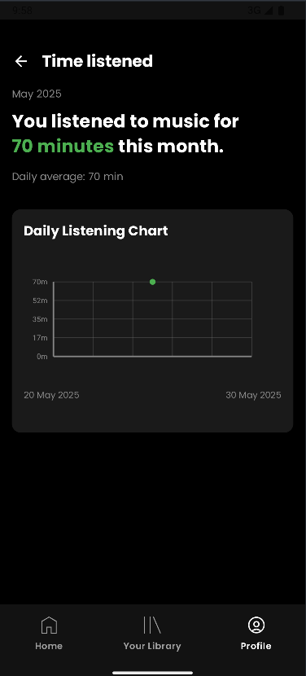
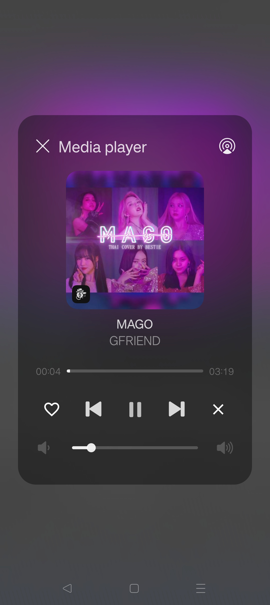

# IF3210-TUBES-MAD-2025

## MILESTONE 2

### Table of Contents
- [General Information](#general-information-milestone-2)
- [Library](#libraries-used-in-milestone-2)
- [Screenshots](#screenshots-milestone-2)
- [Team Members](#team-members-milestone-2)
- [Work Hours](#work-hours-milestone-2)

### General Information (Milestone 2)
Purrytify has been significantly enhanced with advanced features that transform it into a greater music streaming and analytics platform. Building upon the solid foundation of Milestone 1, this version introduces online music integration with Top 50 Global and Top 10 Country charts.

The app now features Sound Capsule Analytics & Export functionality, providing detailed listening insights and data export capabilities. Enhanced notification controls give users granular control over their music experience, while advanced AudioRouting and Output Device management ensures optimal audio quality across different hardware configurations.

Social features have been expanded with Share Songs via URL and QR code generation, making music discovery and sharing seamless. The entire interface has been redesigned with responsive pages that adapt beautifully across orientations. Users can now personalize their picture and location through Edit Profile functionality.

The recommendation engine has been upgraded with Top Mixes feature, delivering personalized music suggestions based on listening patterns.

### Libraries used in Milestone 2
1. androidx.appcompat
2. androidx.appcompat-resources
3. androidx.constraintlayout
4. androidx.constraintlayout-compose
5. androidx.core-ktx
6. androidx.core-splashscreen
7. androidx.datastore-preferences
8. androidx.fragment-ktx
9. androidx.hilt-navigation-compose
10. androidx.lifecycle-runtime-ktx
11. androidx.lifecycle-runtime-compose
12. androidx.lifecycle-viewmodel-compose
13. androidx.navigation-compose
14. androidx.room-compiler
15. androidx.room-ktx
16. androidx.room-runtime
17. androidx.ui-text-google-fonts
18. androidx.work-runtime-ktx
19. androidx.activity-compose
20. androidx.hilt-work
21. androidx.compose-bom
22. androidx.ui
23. androidx.ui-graphics
24. androidx.ui-tooling
25. androidx.ui-tooling-preview
26. androidx.ui-test-manifest
27. androidx.ui-test-junit4
28. androidx.material-icons-extended
29. androidx.material3
30. androidx.palette-ktx
31. androidx.media
32. androidx.media3-session
33. androidx.media3-exoplayer
34. coil-compose
35. converter-gson
36. glide
37. hilt-android
38. hilt-compiler
39. hilt-ext-compiler
40. java-jwt
41. junit
42. androidx.junit
43. androidx.espresso-core
44. kotlinx-coroutines-android
45. logging-interceptor
46. okhttp
47. retrofit
48. material
49. core (ZXing)
50. zxing-android-embedded
51. play-services-location
52. play-services-maps
53. osmdroid-android
54. json

### Screenshots (Milestone 2)
1. Online Songs: Top Charts, Country Charts

  
  
  

 

2. Download Online Songs

  
  

 

3. Sound Capsule Analytics & Export

  
  

 

4. Sound Capsule Analytics: Time Listened, Top Artist, Top Songs

  
  
  

 

5. Notification Controls (Virtual Device, Realme Device, Lock Screen)

  
  
  

 

6. Audio Routing & Output Device:

  
  

 

7. Social Features: Share via URL, QR Code Generation

  
  
  
  

 

8. QR Scanner:

  

 

9. Edit Profile: Picture (Gallery, Camera)

  
  
  

 

10. Edit Profile: Location (Dropdown, Auto, Pinpoint)

  
  

 

11. Responsive Design:

   
   
  
   
   
  
   
   
  
  

 

12. Recommendation: Top Mixes

  

### Project Status (Milestone 2)
Project is complete with advanced features

### Team Members (Milestone 2)
| **NIM**  |           **Nama**            | **Contributions**                                             |
| :------: | :---------------------------: | ------------------------------------------------------------- |
| 13522020 | Aurelius Justin Philo Fanjaya |                                             |
| 13522074 |    Muhammad Naufal Aulia      | Notification controls, QR code scanner, edit profile, online songs UI, sound capsule UI (sound capsule, time listened, top songs, top artist page), all page responsive                                                               |
| 13522090 |        Fedrianz Dharma        |  Online Songs, Download Song, Share URL, Share QR, Recommendation                              |

### Work Hours (Milestone 2)
| **NIM**  |           **Nama**            | **Work Hours**    |
| :------: | :---------------------------: | ----------------- |
| 13522020 | Aurelius Justin Philo Fanjaya |        79         |
| 13522074 |    Muhammad Naufal Aulia      |                 |
| 13522090 |        Fedrianz Dharma        |      50          |

---

## MILESTONE 1

### Table of Contents
- [General Information](#general-information-milestone-1)
- [Library](#libraries-used-in-milestone-1)
- [Screenshots](#screenshots-milestone-1)
- [Team Members](#team-members-milestone-1)
- [Work Hours](#work-hours-milestone-1)

### General Information (Milestone 1)
Purrytify is a feature-rich Android music player app developed to demonstrate core mobile development principles. It implements secure login with JWT-based authentication, token refresh handling, and secure local storage.

The app features a bottom navigation bar with Home, Library, and Profile sections. Home displays recently played and new songs. Library shows all songs and liked songs using RecyclerView, with instant playback support. A Mini Player persists across views, while the full Now Playing screen provides playback controls and a seekable progress bar.

Users can upload songs from external storage, with metadata auto-filled using MediaMetadataRetriever. Uploaded tracks are stored using RoomDatabase, with support for edit/delete. The Profile screen fetches user data via protected endpoints and shows listening stats.

Background services monitor token expiry and refresh when needed. The app also detects network status in real time, handling offline states gracefully with fallback UI.

### Libraries used in Milestone 1
1. androidx.appcompat
2. androidx.appcompat-resources
3. androidx.constraintlayout
4. androidx.constraintlayout-compose
5. androidx.core-ktx
6. androidx.core-splashscreen
7. androidx.datastore-preferences
8. androidx.fragment-ktx
9. androidx.hilt-navigation-compose
10. androidx.lifecycle-runtime-ktx
11. androidx.lifecycle-runtime-compose
12. androidx.lifecycle-viewmodel-compose
13. androidx.navigation-compose
14. androidx.room-compiler
15. androidx.room-ktx
16. androidx.room-runtime
17. androidx.ui-text-google-fonts
18. androidx.work-runtime-ktx
19. androidx.activity-compose
20. androidx.hilt-work
21. androidx.compose-bom
22. androidx.ui
23. androidx.ui-graphics
24. androidx.ui-tooling
25. androidx.ui-tooling-preview
26. androidx.ui-test-manifest
27. androidx.ui-test-junit4
28. androidx.material-icons-extended
29. androidx.material3
30. coil-compose
31. converter-gson
32. glide
33. hilt-android
34. hilt-compiler
35. hilt-ext-compiler
36. java-jwt
37. junit
38. androidx.junit
39. androidx.espresso-core
40. kotlinx-coroutines-android
41. logging-interceptor
42. okhttp
43. retrofit
44. material
45. androidx.media3-session
46. androidx.media3-exoplayer

### Screenshots (Milestone 1)
1. Main Pages: Login, Home Screen, Library Screen, Profile Screen

  
  
  
  

 

2. Library (Liked Tab)

  

 

3. Player, Miniplayer

  
  
  
  

 

4. Add, Edit, Delete Song

  
  
  

 

5. Network Sensing (Profile page & Popup Snackbar)

  
  
  

 

6. Bonus: Queue, Shuffle, Repeat (One & All)

  
  
  

### Project Status (Milestone 1)
Project is complete

### Team Members (Milestone 1)
| **NIM**  |           **Nama**            | **Contributions**                                             |
| :------: | :---------------------------: | ------------------------------------------------------------- |
| 13522020 | Aurelius Justin Philo Fanjaya | Library, profile integration, home integration, edit, delete song                                                              |
| 13522074 |    Muhammad Naufal Aulia      | Home page, Profile page, Navbar, Logout, Network sensing                                                               |
| 13522090 |        Fedrianz Dharma        |  Login, Set up retrofit, database, api, track view, mini player, add song, dependency injnection, repository, background service, queue, shuffle, repeat                                                             |

### Work Hours (Milestone 1)
| **NIM**  |           **Nama**            | **Work Hours**    |
| :------: | :---------------------------: | ----------------- |
| 13522020 | Aurelius Justin Philo Fanjaya |        50         |
| 13522074 |    Muhammad Naufal Aulia      |        54         |
| 13522090 |        Fedrianz Dharma        |        65        |
