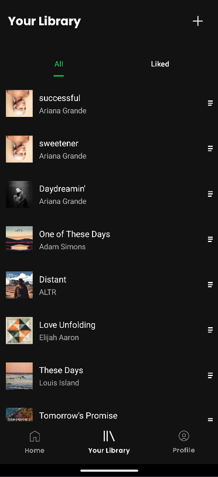

# IF3210-TUBES-MAD-2025

## Table of Contents

- [General Information](#general-information)
- [Library](#libraries-used-in-this-project)
- [Screenshots](#screenshots)
- [Team Members](#team-members)
- [Work Hours](#work-hours)

## General Information

Purrytify is a feature-rich Android music player app developed to demonstrate core mobile development principles. It implements secure login with JWT-based authentication, token refresh handling, and secure local storage.

The app features a bottom navigation bar with Home, Library, and Profile sections. Home displays recently played and new songs. Library shows all songs and liked songs using RecyclerView, with instant playback support. A Mini Player persists across views, while the full Now Playing screen provides playback controls and a seekable progress bar.

Users can upload songs from external storage, with metadata auto-filled using MediaMetadataRetriever. Uploaded tracks are stored using RoomDatabase, with support for edit/delete. The Profile screen fetches user data via protected endpoints and shows listening stats.

Background services monitor token expiry and refresh when needed. The app also detects network status in real time, handling offline states gracefully with fallback UI.

## Libraries used in this project
1. androidx.appcompat
2. androidx.appcompat-resources
3. androidx.constraintlayout
4. androidx.constraintlayout-compose
5. androidx.core-ktx
6. androidx.core-splashscreen
7. androidx.datastore-preferences
8. androidx.fragment-ktx
9. androidx.hilt-navigation-compose
10. androidx.lifecycle-runtime-ktx
11. androidx.lifecycle-runtime-compose
12. androidx.lifecycle-viewmodel-compose
13. androidx.navigation-compose
14. androidx.room-compiler
15. androidx.room-ktx
16. androidx.room-runtime
17. androidx.ui-text-google-fonts
18. androidx.work-runtime-ktx
19. androidx.activity-compose
20. androidx.hilt-work
21. androidx.compose-bom
22. androidx.ui
23. androidx.ui-graphics
24. androidx.ui-tooling
25. androidx.ui-tooling-preview
26. androidx.ui-test-manifest
27. androidx.ui-test-junit4
28. androidx.material-icons-extended
29. androidx.material3
30. coil-compose
31. converter-gson
32. glide
33. hilt-android
34. hilt-compiler
35. hilt-ext-compiler
36. java-jwt
37. junit
38. androidx.junit
39. androidx.espresso-core
40. kotlinx-coroutines-android
41. logging-interceptor
42. okhttp
43. retrofit
44. material
45. androidx.media3-session
46. androidx.media3-exoplayer

## Screenshots
1. Main Pages: Login, Home Screen, Library Screen, Profile Screen

  
  
  
  

 
2. Library (Liked Tab)

  

 
3. Player, Miniplayer

  
  
  
  

 
4. Add, Edit, Delete Song

  
  
  

 
5. Network Sensing (Profile page & Popup Snackbar)

  
  
  

 
6. Bonus: Queue, Shuffle, Repeat (One & All)

  
  
  

## Project Status

Project is complete

## Team Members

| **NIM**  |           **Nama**            | **Contributions**                                             |
| :------: | :---------------------------: | ------------------------------------------------------------- |
| 13522020 | Aurelius Justin Philo Fanjaya | Library, profile integration, home integration, edit, delete song                                                              |
| 13522074 |    Muhammad Naufal Aulia      | Home page, Profile page, Navbar, Logout, Network sensing                                                               |
| 13522090 |        Fedrianz Dharma        |  Login, Set up retrofit, database, api, track view, mini player, add song, dependency injnection, repository, background service, queue, shuffle, repeat                                                             |

## Work Hours

| **NIM**  |           **Nama**            | **Work Hours**    |
| :------: | :---------------------------: | ----------------- |
| 13522020 | Aurelius Justin Philo Fanjaya |        50         |
| 13522074 |    Muhammad Naufal Aulia      |        54         |
| 13522090 |        Fedrianz Dharma        |        150        |

